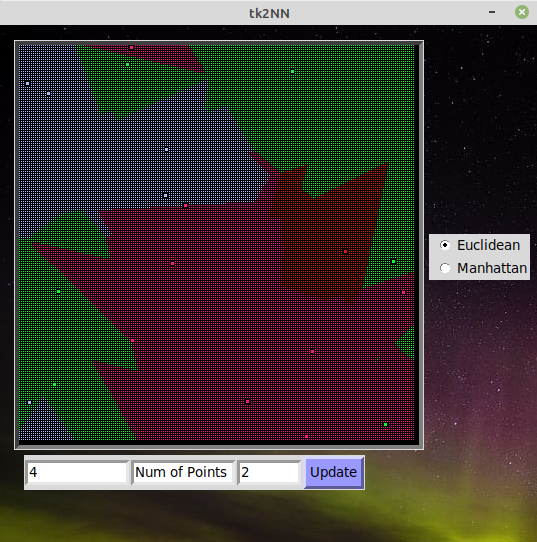

# tk2NN

A weird name, isn't it?  
tk2NN is an implementation of the k-nearest neighbor (kNN) algorithm on tkinter, allowing the user to select points and view the corresponding kNN graphs.  
The colors used for labels are randomized in every iteration and hence may feel awkward at times. You may choose another combination of colors by selecting the same type of distance scheme once more. This basically runs the whole algorithm another time keeping the same points, hence randomizing the colors once more.
***

***
### Implementation
You have to install Python 3.8 since the `statistics.multimode` function has been released in this version.

    sudo add-apt-repository ppa:deadsnakes/ppa
    sudo apt-get update && sudo apt-get install python3.8
    python3.8 -m pip install -r requirements.txt
    python3.8 main.py

***
The structure of the tkinter project is very similar to a tkinter project by the same developer at [TKayTint](github.com/aaronjohnsabu1999/TKayTint). However, the applications are drastically different.