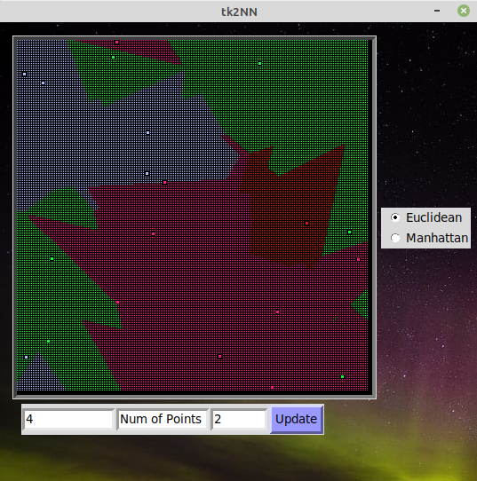

# TKinter-based K-Nearest Neighbors (tk2NN)

**tk2NN** is an interactive visualization of the **k-nearest neighbors (k-NN)** algorithm built using **Tkinter**. It lets you tweak the number of labels, points, and the value of *k*, and watch how the classification map changes in real time. You can toggle between **Euclidean** and **Manhattan** distance metrics, and colors for each label are randomized every time the graph is redrawn - even with the same points. Don’t like the current color scheme? Just re-select the same distance type. Boom. Fresh new look.



## Features

- Switch between Euclidean and Manhattan distances
- Rerun classification instantly with updated parameters
- Random color assignments for each label every time
- Clear all points with a right-click
- Visualizes decision boundaries pixel-by-pixel
- Lightweight Tkinter GUI — no heavy dependencies
- Fully customizable via `config.yaml` — canvas size, colors, default parameters

## Getting Started

### Requirements

- Python **3.8+** (recommended)
- `colour`
- `Pillow`

Install the required packages:

```bash
pip install -r requirements.txt
```

### Run the App

```bash
python run.py
```

> If you're using Linux and want to install Python 3.8 explicitly:

```bash
sudo add-apt-repository ppa:deadsnakes/ppa
sudo apt-get update
sudo apt-get install python3.8
python3.8 -m venv venv
source venv/bin/activate
pip install -r requirements.txt
python run.py
```

## Project Structure

```
tk2nn/
├── app/                  # Core modules
│   ├── gui.py            # Main Tkinter app
│   ├── knn_canvas.py     # k-NN algorithm and classification logic
│   └── utils.py          # Random point generation, color logic, multimode fallback
│
├── assets/               # Images and visual resources
│   ├── bg.png
│   ├── demo.png
│   └── multidemo.png
│
├── config.yaml          # Centralized configuration
├── run.py                # Entry point to launch the app
├── requirements.txt
├── README.md
└── .gitignore
```

## Notes

- The color scheme is randomized **every time** you update or re-select a distance metric.
- This project was inspired by another GUI project [TKayTint](https://github.com/aaronjohnsabu1999/TKayTint) (same developer — different beast).
- It’s a simple educational tool that can be extended to explore classification boundaries, real datasets, or even point dragging and manual labeling.

## Future Ideas

- [ ] Add click-to-label custom point placement
- [ ] Export the canvas as a PNG snapshot
- [ ] Add more distance metrics (Chebyshev? Cosine?)
- [ ] Toggle persistent vs. random color palettes
- [ ] Performance boost with NumPy or shaders (if you’re crazy)

## Contributing

Got ideas? Bugs? Feature requests? Feel free to:
- Fork the repo
- Submit a pull request
- Or just open an issue and yell into the void

## License

This project is licensed under the MIT License. See the `LICENSE` file for more info.
